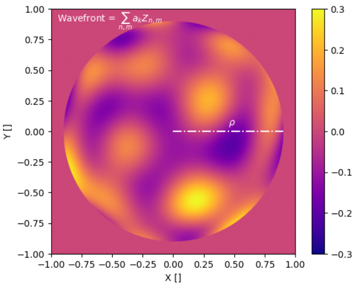

# ZERN - Zernike Polynomials in Python
Python package for the evaluation of Zernike polynomials $Z_{n,m} (\rho, \theta)$. This package implements several methods to calculate Zernike polynomials. One of the methods takes advantage of the relationship between Jacobi polynomials $J_{k}^{\alpha, \beta}$ and the Zernikes, and uses a recurrence to calculate arbitrary polynomials efficiently and robustly. 

This is an installable package that can be used to simulate wavefront maps as a series of Zernike polynomials of arbitrary radial order. It supports any kind of aperture mask, making it flexible for evaluating Zernikes in any astronomical pupil.




## Installation

To install ZERN, you can follow these simple steps:

### 1. Download the files from GitHub

Download the repo directly from Github by running git clone:

```
git clone https://github.com/AlvaroMenduina/ZERN.git <your_local_dir>
```

### 2. Install the package with pip
Move to where you copied the repository files
```
cd <your_local_dir>
```

And run 

```
python setup.py sdist

pip install .
```

### 3. Verifying it all worked
To test whether the installation was successful, you can try to import the module
```python
import zern.zern_core as zern
_test = zern.Zernike(mask=None)
```

## Tutorials
If you are interested in learning how to uze **ZERN**, you can find several Jupyter notebooks [here](/examples/)

## Testing coverage
This package has been thoroughly tested to ensure the results are consistent.

```bash
================================ test session starts ================================ 
platform win32 -- Python 3.11.5, pytest-7.4.2, pluggy-1.3.0
rootdir: C:\Users\alvaro\Documents\Python Scripts\ZERN
plugins: anyio-4.0.0
collected 68 items                                                                                                                                                                                                

tests\test_zern.py ......................................................     [100%] 

================================ 68 passed in 3.54s ===============================
PS C:\Users\alvaro\Documents\Python Scripts\ZERN> coverage report --show-missing
Name                 Stmts   Miss  Cover   Missing
--------------------------------------------------
tests\test_zern.py     120      0   100%
zern\__init__.py         0      0   100%
zern\zern_core.py      116      6    95%   67, 86-88, 117, 262
--------------------------------------------------
TOTAL                  236      6    97%
```